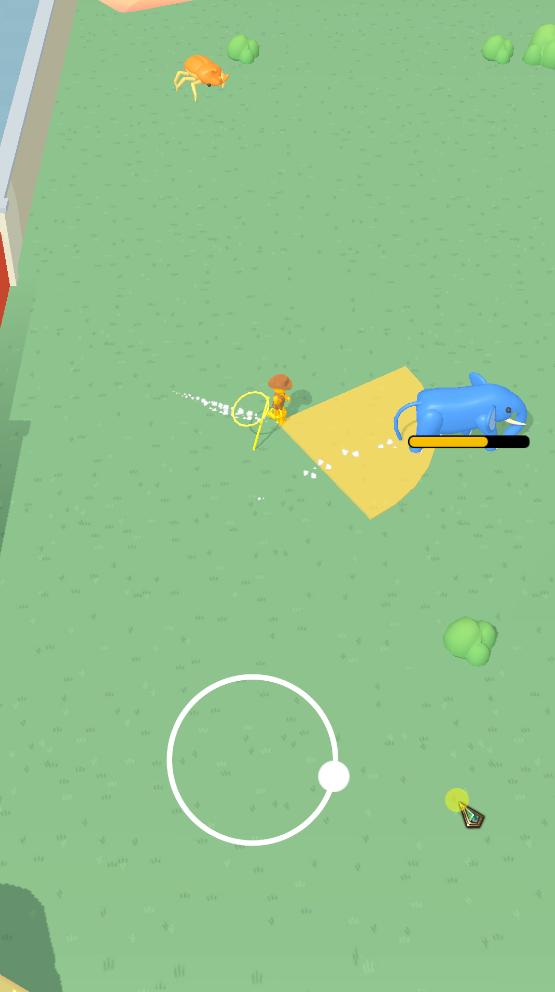
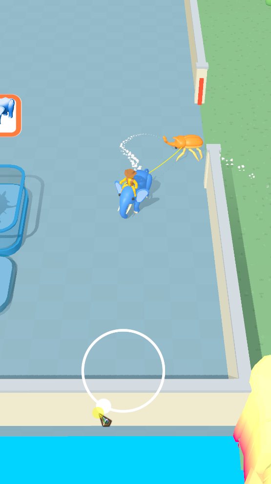
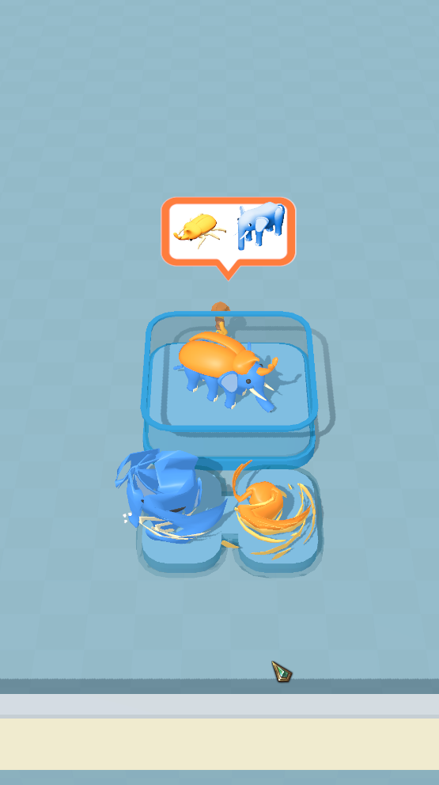
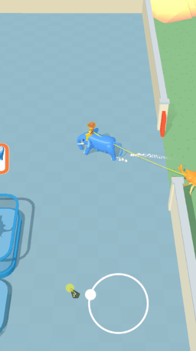

#  Challenge #03 - Unity Engine Hyper Casual Test

  

---
## Summary:

- [About the project](#about-the-project)
- [Getting started](#getting-started)
    - [Cloning the repository](#cloning-the-repository)
    - [Installing dependencies](#installing-dependencies)
    - [Testing](#testing)

---

## About the project

"Challenge #03 - Unity Engine Hyper Casual Test" is an awnser to a knowledge test about Unity Engine game development with C#

You can read the Requirements Document [here](documentation/readme/requirements/requirements.md)

 

The base project contains a bunch of Assets, including 3D models, animations, sprites and a scenario

The challenge objective is to use the assets to implement the required features outlined in the Requirements Document and demonstrated in a demo video within a 7-day timeframe. Optionally, participants can implement extra features that add value to the game

I followed all the requirements to the letter, but always adding feedback behaviors that were more fluid than the base video

### Addition

 

In addition to the requirements, I made two additional changes:

- The player, instead of capturing the animals (as if he had put them in his pocket), mounts the first dominated animal, and he pulls the second one by a rope. I used Blender to create an additional animation clip for moments when the player is jumping on top of an animal

- Instead of the animals only shrinking during the merge animation, they are sucked in like the "spaghetti effect". To achieve this, I developed a graph shader that changes the vertices of animals towards this goal

---

### Getting Started:

##### Cloning the repository:

<!-- To open the project in development mode, you need to have an environment configured with [Yarn](https://yarnpkg.com/getting-started/install) -->
To open the project in development mode, you need to have an environment configured with Unity 3D (preferably: version [2021.3.23](https://unity.com/releases/editor/archive)) and [JovDK](https://github.com/joveem/JovDK) as a git submodule


``` 
git clone https://github.com/joveem/challenge-03-kool-games-unity-test.git
cd challenge-03-kool-games-unity-test
#
```

##### Installing dependencies:

``` sh
# adding the JovDK submodule:
git submodule add https://github.com/joveem/JovDK/ Assets/_JovDK
#
```

##### If the project already has the submodule:

``` sh
# Install/Update dependencies and :
git submodule update --recursive --init
#
```

##### Paste ALL this code in a command line to clone and run the server at once:

``` 
git clone https://github.com/joveem/challenge-03-kool-games-unity-test.git
cd challenge-03-kool-games-unity-test
# adding the JovDK submodule:
git submodule add https://github.com/joveem/JovDK/ Assets/_JovDK
# Install/Update dependencies and :
git submodule update --recursive --init
#
```

### Testing:

Just hit play in the "main-scene" scene
